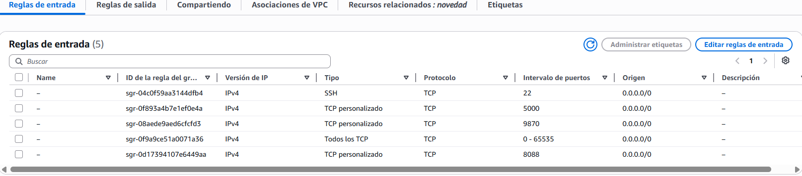
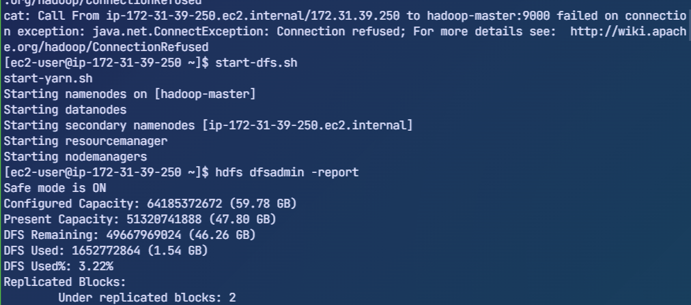
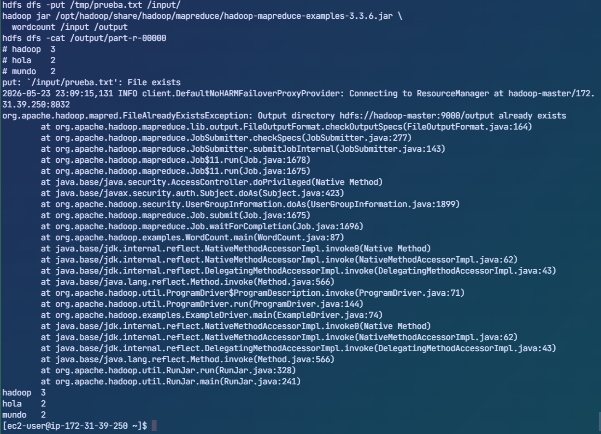
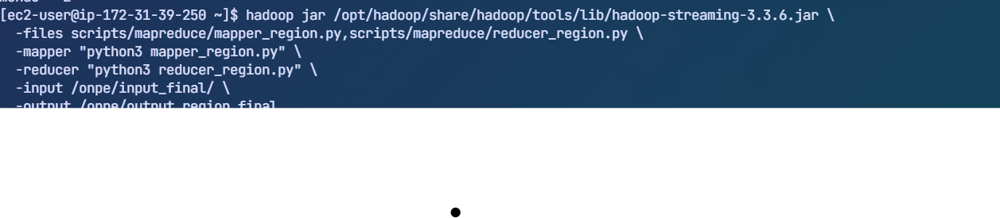
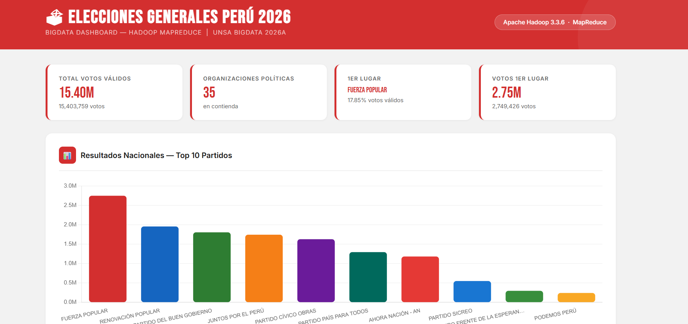
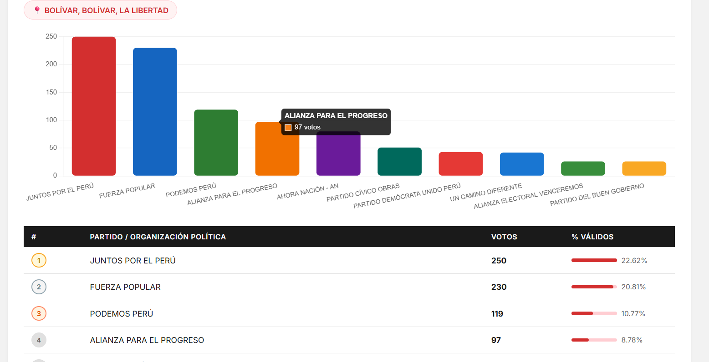

# 🗳️ bd-elecciones-peru-2026

**Procesamiento distribuido de datos electorales con Apache Hadoop y MapReduce**  
BigData 2026A

---

## 📋 Descripción

Pipeline completo de Big Data para el análisis de las **Elecciones Generales del Perú 2026**, que incluye ingesta de datos desde la API pública de la ONPE, procesamiento distribuido con Hadoop MapReduce en un cluster de 4 nodos EC2 en AWS, y visualización interactiva mediante un dashboard web Flask.

---

## 🏗️ Arquitectura del Cluster

```
┌─────────────────────────────────────────────────────────┐
│                    AWS EC2 (us-east-1)                  │
│                                                         │
│  ┌──────────────────┐     ┌──────────────────┐          │
│  │  hadoop-master   │────▶│  hadoop-worker1  │          │
│  │  (NameNode +     │     │  (DataNode +     │          │
│  │  ResourceManager)│     │  NodeManager)    │          │
│  │  t3.small        │     │  t3.small        │          │
│  │  172.31.39.250   │     │  172.31.32.15    │          │
│  └────────┬─────────┘     └──────────────────┘          │
│           │                ┌──────────────────┐          │
│           ├───────────────▶│  hadoop-worker2  │          │
│           │                │  (DataNode +     │          │
│           │                │  NodeManager)    │          │
│           │                │  172.31.38.4     │          │
│           │                └──────────────────┘          │
│           │                ┌──────────────────┐          │
│           └───────────────▶│  hadoop-worker3  │          │
│                            │  (DataNode +     │          │
│                            │  NodeManager)    │          │
│                            │  172.31.46.232   │          │
│                            └──────────────────┘          │
└─────────────────────────────────────────────────────────┘
```

| Componente | Valor |
|---|---|
| Instancias | 4 × t3.small (2 vCPU, 2 GB RAM) |
| SO | Amazon Linux 2023 |
| Hadoop | 3.3.6 |
| Java | Amazon Corretto 11 |
| Almacenamiento HDFS | 59.78 GB total (3 réplicas) |
| Replicación | Factor 3 |

---

## 🔄 Flujo de Trabajo (Pipeline)

```
API ONPE (HTTPS)
      │
      ▼
┌─────────────────┐
│ onpe_ingesta.py │  ← Consumo directo con headers de navegador
│ 92,766 mesas    │  ← Ubigeo con zfill(6) para 6 dígitos
│ ~3.5M filas     │
└────────┬────────┘
         │ votos_final.csv (255 MB)
         ▼
┌─────────────────┐
│      HDFS       │  ← /onpe/input_final/
│  Distribuido    │  ← 3 réplicas en workers
│  en 3 nodos     │
└────────┬────────┘
         │
         ▼
┌─────────────────────────────────────────┐
│           MapReduce Jobs                │
│                                         │
│  Job 1: mapper.py + reducer.py          │
│  → /onpe/output_nacional_final/         │
│  → Votos totales por partido            │
│                                         │
│  Job 2: mapper_region.py +              │
│         reducer_region.py               │
│  → /onpe/output_region_final/           │
│  → Votos por ubigeo × partido           │
└────────┬────────────────────────────────┘
         │
         ▼
┌─────────────────┐
│ Flask Dashboard │  ← Puerto 5000
│ + Chart.js      │  ← Consultas en tiempo real a HDFS
│ + ubigeos.py    │  ← Diccionario de ubigeos de ONPE
└─────────────────┘
```

---

## ⚙️ Instalación y Configuración del Cluster

### 1. Crear instancias EC2

Lanzar **4 instancias** con la siguiente configuración:

| Campo | Valor |
|---|---|
| AMI | Amazon Linux 2023 AMI |
| Tipo | t3.small |
| Almacenamiento | 20 GiB gp3 |
| Key pair | onpe.pem |
| Número de instancias | 4 |
| IP pública | Habilitada |

Nombrar las instancias: `hadoop-master`, `hadoop-worker1`, `hadoop-worker2`, `hadoop-worker3`.

#### Security Group — Reglas de entrada

| Nombre | Protocolo | Puerto | Origen | Descripción |
|---|---|---|---|---|
| SSH | TCP | 22 | 0.0.0.0/0 | Acceso SSH |
| TCP personalizado | TCP | 9870 | 0.0.0.0/0 | HDFS NameNode UI |
| TCP personalizado | TCP | 8088 | 0.0.0.0/0 | YARN ResourceManager UI |
| TCP personalizado | TCP | 5000 | 0.0.0.0/0 | Flask Dashboard |
| Todos los TCP | TCP | 0-65535 | 0.0.0.0/0 | Comunicación entre nodos |



### 2. Configurar SSH desde Windows con VS Code (Wave)

#### Opción A Configuración manual del archivo SSH

Si la carpeta `.ssh` no existe en tu PC, créala:

```powershell
mkdir C:\Users\DIEGO\.ssh
```

Edita o crea el archivo `C:\Users\DIEGO\.ssh\config`:

```
Host hadoop-master
    HostName 35.171.150.251
    User ec2-user
    IdentityFile C:\Users\DIEGO\Documents\onpe.pem
```

Con este alias, conectarse es tan simple como:

```powershell
ssh hadoop-master
```

Cuando AWS reasigne una IP pública al reiniciar las instancias, solo actualiza el campo `HostName` con la nueva IP el alias `hadoop-master` permanece igual.

#### Opción B Configuración en Wave Terminal

Wave es una terminal moderna que permite guardar conexiones SSH con nombre, ícono y color. La configuración se gestiona directamente desde **Settings → Connections** en la interfaz de Wave — no es necesario editar archivos manualmente.

La conexión al master queda guardada con el nombre `aws-onpe` y se accede desde el sidebar con un click. Internamente Wave guarda algo como:

**connections.json:**
```json
{
  "aws-onpe": {
    "conn:wshenabled": true
  }
}
```

**widgets.json** widget del sidebar para acceso rápido:
```json
{
  "widget@ssh-aws-onpe": {
    "display:order": 11,
    "icon": "server",
    "label": "AWS EC2",
    "color": "#ff9900",
    "blockdef": {
      "meta": {
        "view": "term",
        "controller": "shell",
        "connection": "aws-onpe"
      }
    }
  }
}
```

> **Cuando cambia la IP:** Ve a **C:\Users\USER\.ssh\config** y actualiza solo la dirección IP. El nombre de la conexión, el widget del sidebar y todos los terminales abiertos siguen funcionando igual no se reconfigura nada más.

### 3. Configurar /etc/hosts en los 4 nodos
Se deben reemplazar con las ips privadas de cada nodo (no las públicas) para que Hadoop pueda resolver los nombres internamente.
```bash
sudo tee -a /etc/hosts << 'EOF'
172.31.39.250 hadoop-master
172.31.32.15  hadoop-worker1
172.31.38.4   hadoop-worker2
172.31.46.232 hadoop-worker3
EOF
```

### 4. Instalar Java en los 4 nodos

```bash
sudo dnf install -y java-11-amazon-corretto
java -version
# openjdk version "11.0.31" 2026-04-21 LTS
```

### 5. Instalar Hadoop en los 4 nodos

```bash
wget https://downloads.apache.org/hadoop/common/hadoop-3.3.6/hadoop-3.3.6.tar.gz
tar -xzf hadoop-3.3.6.tar.gz
sudo mv hadoop-3.3.6 /opt/hadoop

echo 'export HADOOP_HOME=/opt/hadoop' >> ~/.bashrc
echo 'export PATH=$PATH:$HADOOP_HOME/bin:$HADOOP_HOME/sbin' >> ~/.bashrc
echo 'export JAVA_HOME=/usr/lib/jvm/java-11-amazon-corretto' >> ~/.bashrc
source ~/.bashrc

hadoop version
# Hadoop 3.3.6
```

### 6. Configurar SSH sin contraseña entre nodos

En el **master**:

```bash
ssh-keygen -t rsa -P "" -f ~/.ssh/id_rsa
cat ~/.ssh/id_rsa.pub >> ~/.ssh/authorized_keys
chmod 600 ~/.ssh/authorized_keys
```

Saldra algo como:

```bash
ssh-rsa AAAAB3NzaC1yc2EAAAADAQABAAABAQC3... usuario@hadoop-master
```

En cada **worker** (pegar la clave pública del master):

```bash
echo "<clave-publica-del-master>" >> ~/.ssh/authorized_keys
chmod 600 ~/.ssh/authorized_keys
```

La clave publica se colocaria asi:
```bash
echo "ssh-rsa AAAAB3NzaC1yc2EAAAADAQABAAABAQC3... usuario@hadoop-master
" >> ~/.ssh/authorized_keys
chmod 600 ~/.ssh/authorized_keys
```

Se usa de la forma:

```bash
ssh ec2-user@hadoop-worker1
ssh ec2-user@hadoop-worker2
ssh ec2-user@hadoop-worker3
```

Verificar desde el master:

```bash
ssh ec2-user@172.31.32.15 hostname   # ip-172-31-32-15.ec2.internal
ssh ec2-user@172.31.38.4 hostname    # ip-172-31-38-4.ec2.internal
ssh ec2-user@172.31.46.232 hostname  # ip-172-31-46-232.ec2.internal
```

### 7. Configurar archivos Hadoop

Crear y copiar a los 4 nodos:

**`/opt/hadoop/etc/hadoop/core-site.xml`**
```xml
<configuration>
  <property>
    <name>fs.defaultFS</name>
    <value>hdfs://hadoop-master:9000</value>
  </property>
</configuration>
```

**`/opt/hadoop/etc/hadoop/hdfs-site.xml`**
```xml
<configuration>
  <property>
    <name>dfs.replication</name>
    <value>3</value>
  </property>
  <property>
    <name>dfs.namenode.name.dir</name>
    <value>/opt/hadoop/data/namenode</value>
  </property>
  <property>
    <name>dfs.datanode.data.dir</name>
    <value>/opt/hadoop/data/datanode</value>
  </property>
</configuration>
```

**`/opt/hadoop/etc/hadoop/mapred-site.xml`**
```xml
<configuration>
  <property>
    <name>mapreduce.framework.name</name>
    <value>yarn</value>
  </property>
  <property>
    <name>yarn.app.mapreduce.am.env</name>
    <value>HADOOP_MAPRED_HOME=/opt/hadoop</value>
  </property>
  <property>
    <name>mapreduce.map.env</name>
    <value>HADOOP_MAPRED_HOME=/opt/hadoop</value>
  </property>
  <property>
    <name>mapreduce.reduce.env</name>
    <value>HADOOP_MAPRED_HOME=/opt/hadoop</value>
  </property>
</configuration>
```

**`/opt/hadoop/etc/hadoop/yarn-site.xml`**
```xml
<configuration>
  <property>
    <name>yarn.resourcemanager.hostname</name>
    <value>hadoop-master</value>
  </property>
  <property>
    <name>yarn.nodemanager.aux-services</name>
    <value>mapreduce_shuffle</value>
  </property>
</configuration>
```

**`/opt/hadoop/etc/hadoop/workers`**
```
hadoop-worker1
hadoop-worker2
hadoop-worker3
```

Copiar configuración a workers desde el master:

```bash
for worker in hadoop-worker1 hadoop-worker2 hadoop-worker3; do
  scp /opt/hadoop/etc/hadoop/core-site.xml ec2-user@$worker:/tmp/
  scp /opt/hadoop/etc/hadoop/hdfs-site.xml ec2-user@$worker:/tmp/
  scp /opt/hadoop/etc/hadoop/mapred-site.xml ec2-user@$worker:/tmp/
  scp /opt/hadoop/etc/hadoop/yarn-site.xml ec2-user@$worker:/tmp/
  ssh ec2-user@$worker "sudo mv /tmp/*.xml /opt/hadoop/etc/hadoop/"
  echo "$worker configurado"
done
```

### 8. Crear directorios y formatear HDFS

En el **master**:
```bash
sudo mkdir -p /opt/hadoop/data/namenode
sudo chown -R ec2-user:ec2-user /opt/hadoop/data
hdfs namenode -format
# Storage directory /opt/hadoop/data/namenode has been successfully formatted.
```

En cada **worker**:
```bash
sudo mkdir -p /opt/hadoop/data/datanode
sudo chown -R ec2-user:ec2-user /opt/hadoop/data
```

### 9. Arrancar el cluster

```bash
start-dfs.sh
start-yarn.sh
hdfs dfsadmin -report
# Live datanodes (3): hadoop-worker1, hadoop-worker2, hadoop-worker3
```



---

## 📥 Ingesta de Datos

### API pública ONPE

```
GET https://resultadoelectoral.onpe.gob.pe/presentacion-backend/actas/buscar/mesa
    ?codigoMesa=<CODIGO>&idEleccion=10
```

El parámetro `idEleccion=10` identifica las Elecciones Generales 2026. La API requiere headers de navegador para devolver JSON en lugar de HTML.

### `scripts/ingesta/onpe_ingesta.py`

**Entrada:** rango de mesas (argumentos de línea de comandos)  
**Salida:** `votos_final.csv`

```bash
# Descarga completa en background
nohup python3 scripts/ingesta/onpe_ingesta.py 1 92766 > ingesta_final.log 2>&1 &

# Con rango específico
python3 scripts/ingesta/onpe_ingesta.py 1000 5000

# Monitorear progreso
wc -l votos_final.csv
tail ingesta_final.log
```
> **Mejora recomendada:** El script `onpe_ingesta.py` incluye reintentos automáticos (3 intentos con 2 segundos de espera) para mesas que no respondan. Antes de lanzar la descarga paralela, copia el script actualizado a los workers con el comando del Paso 1.

### Descarga paralela con los 3 workers

Para reducir el tiempo de descarga de ~1.5 horas a ~30 minutos, se puede distribuir la ingesta entre los 3 workers:

**Paso 1 Copiar el script a los workers:**
```bash
for worker in hadoop-worker1 hadoop-worker2 hadoop-worker3; do
  scp /home/ec2-user/onpe_ingesta.py ec2-user@$worker:/home/ec2-user/
  echo "$worker listo"
done
```

**Paso 2 Lanzar en paralelo desde el master:**
```bash
ssh ec2-user@hadoop-worker1 "nohup python3 /home/ec2-user/onpe_ingesta.py 1 30922 > /home/ec2-user/ingesta1.log 2>&1 &"
ssh ec2-user@hadoop-worker2 "nohup python3 /home/ec2-user/onpe_ingesta.py 30923 61844 > /home/ec2-user/ingesta2.log 2>&1 &"
ssh ec2-user@hadoop-worker3 "nohup python3 /home/ec2-user/onpe_ingesta.py 61845 92766 > /home/ec2-user/ingesta3.log 2>&1 &"
echo "Los 3 workers descargando en paralelo"
```

**Paso 3 Monitorear progreso:**
```bash
echo "Worker1:"; ssh ec2-user@hadoop-worker1 "wc -l /home/ec2-user/votos_final.csv"
echo "Worker2:"; ssh ec2-user@hadoop-worker2 "wc -l /home/ec2-user/votos_final.csv"
echo "Worker3:"; ssh ec2-user@hadoop-worker3 "wc -l /home/ec2-user/votos_final.csv"
```

**Paso 4 Juntar los 3 CSV en el master:**
```bash
mkdir -p /home/ec2-user/votos
mkdir -p /home/ec2-user/votos_completos
scp ec2-user@hadoop-worker1:/home/ec2-user/votos_final.csv /home/ec2-user/votos/votos1.csv
scp ec2-user@hadoop-worker2:/home/ec2-user/votos_final.csv /home/ec2-user/votos/votos2.csv
scp ec2-user@hadoop-worker3:/home/ec2-user/votos_final.csv /home/ec2-user/votos/votos3.csv

head -1 /home/ec2-user/votos/votos1.csv > /home/ec2-user/votos_completos/votos_completo.csv
tail -n +2 /home/ec2-user/votos/votos1.csv >> /home/ec2-user/votos_completos/votos_completo.csv
tail -n +2 /home/ec2-user/votos/votos2.csv >> /home/ec2-user/votos_completos/votos_completo.csv
tail -n +2 /home/ec2-user/votos/votos3.csv >> /home/ec2-user/votos_completos/votos_completo.csv
wc -l /home/ec2-user/votos/votos_completo.csv
```

**Paso 5 Subir a HDFS y procesar con MapReduce:**
Subir archivo por archivo
```bash
hdfs dfs -mkdir -p /onpe/input_paralelo
#Podemos subir los 3 archivos por separado o el archivo completo, ambos funcionan igual porque MapReduce procesa todos los archivos de la carpeta automáticamente
hdfs dfs -put /home/ec2-user/votos/votos1.csv /onpe/input_paralelo/
hdfs dfs -put /home/ec2-user/votos/votos2.csv /onpe/input_paralelo/
hdfs dfs -put /home/ec2-user/votos/votos3.csv /onpe/input_paralelo/
# MapReduce procesa todos los archivos de la carpeta automáticamente
hadoop jar /opt/hadoop/share/hadoop/tools/lib/hadoop-streaming-3.3.6.jar \
  -files mapper.py,reducer.py \
  -mapper "python3 mapper.py" \
  -reducer "python3 reducer.py" \
  -input /onpe/input_paralelo/ \
  -output /onpe/output_nacional_paralelo
```

O subir el archivo junto de golpe

```bash
hdfs dfs -mkdir -p /onpe/input_paralelo
# O podemos usar el archivo completo
hdfs dfs -put /home/ec2-user/votos/votos_completos/votos_completo.csv /onpe/input_paralelo/
# MapReduce procesa todos los archivos de la carpeta automáticamente
hadoop jar /opt/hadoop/share/hadoop/tools/lib/hadoop-streaming-3.3.6.jar \
  -files mapper.py,reducer.py \
  -mapper "python3 mapper.py" \
  -reducer "python3 reducer.py" \
  -input /onpe/input_paralelo/ \
  -output /onpe/output_nacional_paralelo
```

> **Nota:** El script incluye reintentos automáticos — si una mesa no responde, espera 2 segundos y reintenta hasta 3 veces antes de saltarla.

### `scripts/consultas/ver_mesa.py`

Consulta y muestra los datos de una mesa específica.

**Entrada:** código de mesa (argumento)  
**Salida:** información de la mesa en pantalla

```bash
python3 scripts/consultas/ver_mesa.py 007172
```

Ejemplo de salida:
```
=== INFORMACIÓN DE LA MESA ===
Código Mesa:        007172
Local de votación:  IE 40172
Ubigeo:             040119
Electores hábiles:  236
Votos emitidos:     181
Votos válidos:      162
Estado acta:        Contabilizada

=== VOTOS POR PARTIDO ===
  AHORA NACIÓN - AN: 17 votos
  JUNTOS POR EL PERÚ: 42 votos
  ...
```

### Estructura del CSV resultante

```
codigo_mesa, ubigeo, local_votacion, partido, votos, votos_validos_mesa
000001, 010101, IE 18288 ISABEL LYNCH DE RUBIO, FUERZA POPULAR, 54, 134
000001, 010101, IE 18288 ISABEL LYNCH DE RUBIO, JUNTOS POR EL PERÚ, 42, 134
```

| Métrica | Valor |
|---|---|
| Mesas consultadas | 92,766 |
| Mesas contabilizadas | ~87,000 |
| Filas totales | 3,571,224 |
| Tamaño CSV | ~255 MB |
| Partidos por mesa | 41 |

---

## 🗺️ Diccionario de Ubigeos

Los ubigeos de la ONPE no coinciden con los del RENIEC ni INEI. Se descargaron directamente desde la propia API de la ONPE usando tres endpoints:

```
GET /presentacion-backend/ubigeos/departamentos?idEleccion=10&idAmbitoGeografico=1
GET /presentacion-backend/ubigeos/provincias?idEleccion=10&...&idUbigeoDepartamento=040000
GET /presentacion-backend/ubigeos/distritos?idEleccion=10&...&idUbigeoProvincia=040100
```

### `scripts/ubigeos/descargar_ubigeos.py`

**Entrada:** ninguna (consume las APIs de ONPE)  
**Salida:** `ubigeos_onpe.json` con 2,113 entradas

```bash
python3 scripts/ubigeos/descargar_ubigeos.py
# Departamentos: 25
#   AMAZONAS: 7 provincias procesadas
#   AREQUIPA: 8 provincias procesadas
#   ...
# Total ubigeos descargados: 2113
```

### `scripts/ubigeos/generar_dict_ubigeos.py`

**Entrada:** `ubigeos_onpe.json`  
**Salida:** `scripts/ubigeos/ubigeos.py` (diccionario Python)

```bash
python3 scripts/ubigeos/generar_dict_ubigeos.py
# ubigeos.py generado con 2113 entradas
```

### `scripts/ubigeos/ubigeos.py`

Diccionario Python listo para importar con funciones de consulta:

```python
from ubigeos import get_full, get_departamento, get_provincia, get_distrito

get_full("040103")        # "CERRO COLORADO, AREQUIPA, AREQUIPA"
get_full("040127")        # "JACOBO HUNTER, AREQUIPA, AREQUIPA"
get_full("140101")        # "LIMA, LIMA, LIMA"
get_departamento("040103") # "AREQUIPA"
get_provincia("040103")    # "AREQUIPA"
get_distrito("040103")     # "CERRO COLORADO"
```

---

## 🔀 MapReduce

### Prueba WordCount

```bash
echo "hola mundo hola hadoop mundo hadoop hadoop" > /tmp/prueba.txt
hdfs dfs -mkdir -p /input
hdfs dfs -put /tmp/prueba.txt /input/
hadoop jar /opt/hadoop/share/hadoop/mapreduce/hadoop-mapreduce-examples-3.3.6.jar \
  wordcount /input /output
hdfs dfs -cat /output/part-r-00000
# hadoop  3
# hola    2
# mundo   2
```



### Subir datos a HDFS

```bash
hdfs dfs -mkdir -p /onpe/input_final
hdfs dfs -put votos_final.csv /onpe/input_final/
hdfs dfs -ls -h /onpe/input_final/
# 255.0 M  /onpe/input_final/votos_final.csv
```

### Job 1 Resultados Nacionales

**`scripts/mapreduce/mapper.py`** emite `partido \t votos` por cada fila  
**`scripts/mapreduce/reducer.py`** agrupa por partido y suma votos

```bash
hadoop jar /opt/hadoop/share/hadoop/tools/lib/hadoop-streaming-3.3.6.jar \
  -files scripts/mapreduce/mapper.py,scripts/mapreduce/reducer.py \
  -mapper "python3 mapper.py" \
  -reducer "python3 reducer.py" \
  -input /onpe/input_final/ \
  -output /onpe/output_nacional_final
```

### Job 2 Resultados por Región

**`scripts/mapreduce/mapper_region.py`** emite `ubigeo|||partido \t votos`  
**`scripts/mapreduce/reducer_region.py`** agrupa por clave compuesta y suma

```bash
hadoop jar /opt/hadoop/share/hadoop/tools/lib/hadoop-streaming-3.3.6.jar \
  -files scripts/mapreduce/mapper_region.py,scripts/mapreduce/reducer_region.py \
  -mapper "python3 mapper_region.py" \
  -reducer "python3 reducer_region.py" \
  -input /onpe/input_final/ \
  -output /onpe/output_region_final
```

> **Nota técnica:** La clave compuesta `ubigeo|||partido` fue necesaria porque Hadoop distribuye el procesamiento entre workers. Con solo `ubigeo` como clave, el sort no garantizaba que todos los registros de un mismo `ubigeo+partido` llegaran al mismo reducer, generando duplicados en los resultados.



---

## 📊 Resultados

### Nacional (Top 10) `votos_final.csv`

```bash
hdfs dfs -cat /onpe/output_nacional_final/part-00000 | sort -t$'\t' -k2 -rn
```

```
FUERZA POPULAR                              2,749,426
RENOVACIÓN POPULAR                          1,956,941
PARTIDO DEL BUEN GOBIERNO                   1,805,979
JUNTOS POR EL PERÚ                          1,744,953
PARTIDO CÍVICO OBRAS                        1,629,586
PARTIDO PAÍS PARA TODOS                     1,295,642
AHORA NACIÓN - AN                           1,182,688
PARTIDO SICREO                                550,379
PARTIDO FRENTE DE LA ESPERANZA 2021           297,803
PODEMOS PERÚ                                  242,508
```

### Comparación con ONPE Oficial (Nacional)

| Partido | Nuestro MapReduce | ONPE Oficial | Diferencia |
|---|---|---|---|
| FUERZA POPULAR | 2,749,426 | 2,877,678 | -128,252 (~4.5%) |
| RENOVACIÓN POPULAR | 1,956,941 | 1,993,905 | -36,964 (~1.9%) |
| PARTIDO DEL BUEN GOBIERNO | 1,805,979 | 1,837,517 | -31,538 (~1.7%) |
| JUNTOS POR EL PERÚ | 1,744,953 | 2,015,114 | -270,161 (~13%) |

> La diferencia se debe a mesas que no respondieron durante la descarga (timeouts con `sleep=0.05s`). Los resultados a nivel distrito y provincia coinciden exactamente.

### Arequipa Departamento (código `04`)

```bash
python3 scripts/consultas/consulta_region.py departamento 04
```

```
=== Resultados por DEPARTAMENTO: AREQUIPA ===
  PARTIDO DEL BUEN GOBIERNO                  162,292
  PARTIDO CÍVICO OBRAS                        94,483
  RENOVACIÓN POPULAR                          92,265
  JUNTOS POR EL PERÚ                          86,175
  AHORA NACIÓN - AN                           80,779
```

### Provincia Arequipa (código `0401`)

```bash
python3 scripts/consultas/consulta_region.py provincia 0401
```

```
=== Resultados por PROVINCIA: AREQUIPA, AREQUIPA ===
  PARTIDO DEL BUEN GOBIERNO                  145,606
  RENOVACIÓN POPULAR                          82,557
  PARTIDO CÍVICO OBRAS                        69,340
  AHORA NACIÓN - AN                           68,637
  PARTIDO PAÍS PARA TODOS                     59,907
```

### Jacobo Hunter, Arequipa Distrito (código `040127`)

```bash
python3 scripts/consultas/consulta_region.py distrito 040127
```

```
=== Resultados por DISTRITO: JACOBO HUNTER, AREQUIPA, AREQUIPA ===
  PARTIDO DEL BUEN GOBIERNO                    6,837
  AHORA NACIÓN - AN                            3,480
  PARTIDO CÍVICO OBRAS                         3,316
  PARTIDO PAÍS PARA TODOS                      3,122
  RENOVACIÓN POPULAR                           2,170
```

### Comparación por Distrito (Jacobo Hunter) con ONPE Oficial

| Partido | Nuestro MapReduce | ONPE Oficial | ✓ |
|---|---|---|---|
| PARTIDO DEL BUEN GOBIERNO | 6,837 | 6,921 | ≈ ✅ |
| AHORA NACIÓN - AN | 3,480 | 3,546 | ≈ ✅ |
| PARTIDO CÍVICO OBRAS | 3,316 | 3,372 | ≈ ✅ |
| PARTIDO PAÍS PARA TODOS | 3,122 | 3,166 | ≈ ✅ |

### Lima Distrito (código `140101`)

```bash
python3 scripts/consultas/consulta_region.py distrito 140101
```

```
=== Resultados por DISTRITO: LIMA, LIMA, LIMA ===
  RENOVACIÓN POPULAR                          42,270
  FUERZA POPULAR                              37,298
  PARTIDO DEL BUEN GOBIERNO                   34,170
  PARTIDO PAÍS PARA TODOS                     18,582
  AHORA NACIÓN - AN                           16,064
```


### Bolivar Distrito(código `120201`)
La mayoria coinciden en datos con los de la ONPE.
```bash

python3 scripts/consultas/consulta_region.py distrito 120201
```
```
=== Resultados por DISTRITO: BOLÍVAR, BOLÍVAR, LA LIBERTAD ===
  JUNTOS POR EL PERÚ                                        250
  FUERZA POPULAR                                            230
  PODEMOS PERÚ                                              119
  ALIANZA PARA EL PROGRESO                                   97
  AHORA NACIÓN - AN                                          80
```


---

## 🌐 Dashboard Web


### Instalación

```bash
pip3 install flask
```

### Ejecución


```bash
# Iniciar con datos finales (default)
nohup python3 dashboard/dashboard.py > dashboard.log 2>&1 &

# Iniciar con datos específicos
nohup python3 dashboard/dashboard.py /onpe/output_nacional_paralelo /onpe/output_region_paralelo > dashboard.log 2>&1 &

# Verificar que corre
tail dashboard.log
# * Running on http://0.0.0.0:5000

# Detener
kill $(ps aux | grep dashboard.py | grep -v grep | awk '{print $2}')
```

Acceder en: `http://<IP-PUBLICA-MASTER>:5000`

### Uso de filtros en cascada

```
1. Selecciona Departamento → ej: AREQUIPA
2. Selecciona Provincia    → ej: AREQUIPA  (se carga automáticamente)
3. Selecciona Distrito     → ej: JACOBO HUNTER (se carga automáticamente)
4. Click en "Buscar"
```

### Endpoints de la API Flask

| Endpoint | Descripción |
|---|---|
| `GET /api/nacional` | Resultados nacionales ordenados |
| `GET /api/region?nivel=departamento&codigo=04` | Resultados por departamento |
| `GET /api/region?nivel=provincia&codigo=0401` | Resultados por provincia |
| `GET /api/region?nivel=distrito&codigo=040127` | Resultados por distrito |
| `GET /api/departamentos` | Lista todos los departamentos |
| `GET /api/provincias?dpto=040000` | Provincias de un departamento |
| `GET /api/distritos?prov=040100` | Distritos de una provincia |




---

## 📁 Estructura del Repositorio

```
bd-elecciones-peru-2026/
├── README.md
├── dashboard/
│   ├── dashboard.py          # Servidor Flask
│   └── dashboard.html        # Frontend con Chart.js
├── scripts/
│   ├── ingesta/
│   │   └── onpe_ingesta.py   # Descarga datos de API ONPE
│   ├── mapreduce/
│   │   ├── mapper.py         # Mapper Job 1 (nacional)
│   │   ├── reducer.py        # Reducer Job 1 (nacional)
│   │   ├── mapper_region.py  # Mapper Job 2 (regional)
│   │   └── reducer_region.py # Reducer Job 2 (regional)
│   ├── consultas/
│   │   ├── consulta_region.py # Consultas por nivel geográfico
│   │   └── ver_mesa.py        # Consulta una mesa específica
│   └── ubigeos/
│       ├── descargar_ubigeos.py    # Descarga ubigeos de API ONPE
│       ├── generar_dict_ubigeos.py # Genera diccionario Python
│       └── ubigeos.py              # Diccionario listo para usar
├── data/
│   └── ubigeos_onpe.json     # 2,113 ubigeos en JSON
└── screenshots/
    ├── 01_ec2_instancias.png
    ├── 02_ec2_security_group.png
    ├── 03_ssh_conexion_master.png
    ├── 04_hadoop_version.png
    ├── 05_cluster_activo.png
    ├── 06_yarn_ui.png
    ├── 07_hdfs_ui.png
    ├── 08_wordcount_prueba.png
    ├── 09_ingesta_progreso.png
    ├── 10_mapreduce_nacional.png
    ├── 11_mapreduce_regional.png
    ├── 12_resultados_nacional.png
    ├── 13_comparacion_onpe.png
    ├── 14_dashboard_inicio.png
    ├── 15_dashboard_region.png
    └── demo.gif
```

### Estructura HDFS

```
/onpe/
├── input_final/              # votos_final.csv (255 MB)
├── output_nacional_final/    # Resultados nacionales (1.2 KB)
└── output_region_final/      # Resultados por distrito (2.6 MB)
```

---

## 🔌 Interfaces Web del Cluster

| URL | Descripción |
|---|---|
| `http://<IP>:9870` | HDFS NameNode UI |
| `http://<IP>:8088` | YARN ResourceManager UI |
| `http://<IP>:5000` | Dashboard electoral |

---

## ▶️ Comandos de Referencia

```bash
# Iniciar/detener cluster
start-dfs.sh && start-yarn.sh
stop-yarn.sh && stop-dfs.sh

# Estado del cluster
hdfs dfsadmin -report

# Listar archivos HDFS
hdfs dfs -ls -h /onpe/

# Ver resultados nacionales
hdfs dfs -cat /onpe/output_nacional_final/part-00000 | sort -t$'\t' -k2 -rn

# Consultar por región
python3 scripts/consultas/consulta_region.py departamento 04
python3 scripts/consultas/consulta_region.py provincia 0401
python3 scripts/consultas/consulta_region.py distrito 040127

# Consultar mesa específica
python3 scripts/consultas/ver_mesa.py 007172

# Descargar datos frescos
nohup python3 scripts/ingesta/onpe_ingesta.py 1 92766 > ingesta.log 2>&1 &

# Consultar por región con carpeta específica
python3 scripts/consultas/consulta_region.py departamento 04 /onpe/output_region_paralelo
python3 scripts/consultas/consulta_region.py provincia 0401 /onpe/output_region_paralelo
python3 scripts/consultas/consulta_region.py distrito 040127 /onpe/output_region_paralelo

# Correr jobs con datos paralelos
hadoop jar /opt/hadoop/share/hadoop/tools/lib/hadoop-streaming-3.3.6.jar \
  -files mapper.py,reducer.py \
  -mapper "python3 mapper.py" \
  -reducer "python3 reducer.py" \
  -input /onpe/input_paralelo/ \
  -output /onpe/output_nacional_paralelo

hadoop jar /opt/hadoop/share/hadoop/tools/lib/hadoop-streaming-3.3.6.jar \
  -files mapper_region.py,reducer_region.py \
  -mapper "python3 mapper_region.py" \
  -reducer "python3 reducer_region.py" \
  -input /onpe/input_paralelo/ \
  -output /onpe/output_region_paralelo

```

---

## 📌 Notas

- Las capturas de pantalla y GIF de demostración se encuentran en `/screenshots`
- Los resultados nacionales presentan una diferencia del ~3-5% respecto a la ONPE oficial, atribuible a mesas que no respondieron durante la descarga (timeouts)
- Los resultados a nivel distrito y provincia coinciden con la plataforma oficial de la ONPE
- Los ubigeos de ONPE difieren de los de RENIEC e INEI — usar siempre `ubigeos_onpe.json`

---

## 👥 Autores

Universidad Nacional de San Agustín de Arequipa  
Escuela Profesional de Ciencia de la Computación  
Curso: BigData 2026A — Laboratorio 03
